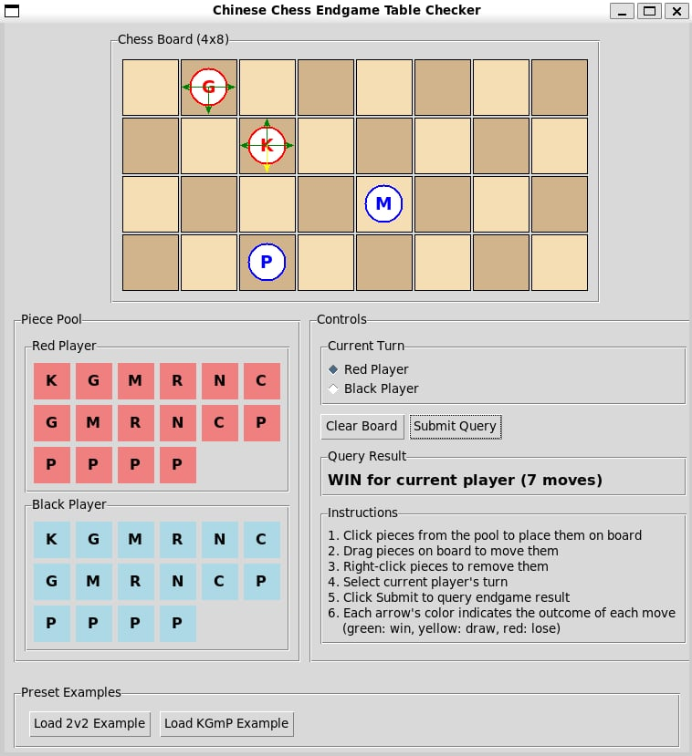

# Endgame Table Generator

A bottom-up minimax algorithm implementation for Chinese Dark Chess endgame analysis with cycle detection and draw state resolution.



## Overview
This project implements an endgame tablebase generator for Chinese Dark Chess using a novel bottom-up minimax approach. Unlike traditional top-down minimax algorithms that fail in graphs with cycles, our algorithm can correctly identify and classify draw positions.

## Algorithm Description
### The Issue with Traditional Minimax
Traditional minimax algorithms use a top-down approach similar to Depth-First Search (DFS). However, this approach fails in game graphs containing cycles, where draw boards cannot be successfully labeled using conventional methods.
### Bottom-Up Minimax Solution
Our algorithm is based on two fundamental minimax principles:

1. A state is **winning** if **any** of its children is **losing**
2. A state is **losing** if **all** of its children are **winning**

### Algorithm Steps

```
1. Initialize each state's "HP" (Health Points) to its degree (number of children)
2. Push all terminal states into the processing queue
3. While the queue is not empty:
   a. Pop a state from the queue
   b. If the state result is LOSE:
      - Find all reverse-children (parent states)
      - Mark all of them as WIN
      - Add unvisited parents to the queue
   c. If the state result is WIN:
      - Find all reverse-children
      - Decrease their HP by 1
      - If a reverse-child's HP reaches 0:
        * Mark it as LOSE
        * Add it to the queue
4. After the queue is empty, remaining unvisited states are marked as DRAW
```

### Key Features

* Cycle-aware: Handles cyclic game graphs correctly
* Draw detection: Accurately identifies draw positions
* Efficient: Bottom-up propagation minimizes redundant calculations

### Implementation
The algorithm is implemented in C++ with the following key components:

* State representation: Game positions with piece locations and turn information
* Move generation: Legal move calculation for each position
* Reverse neighbor finding: Efficiently finds parent states

### Board Cache

The finished tables will be stored in `endgame_build/cached_endgame_boards`, so you can directly perform queries without re-building the whole table all again next time.

## UI

A Python-based graphical interface for interacting with the Chinese Chess endgame tablebase generator.
### Features

* Interactive 4×8 Board: Visual representation of the chess board with drag-and-drop piece placement
* Analysis: Submit button queries the C++ endgame engine and displays results
* Move Visualization: Colored arrows show all possible moves and their outcomes:
    * 🟢 Green: Winning moves
    * 🟠 Orange: Drawing moves
    * 🔴 Red: Losing moves

## How to Run

```
git clone https://github.com/cloud1204/darkchess_endgame.git
cd darkchess_endgame/endgame_build
make
cd ..
python endgame_query.py
```